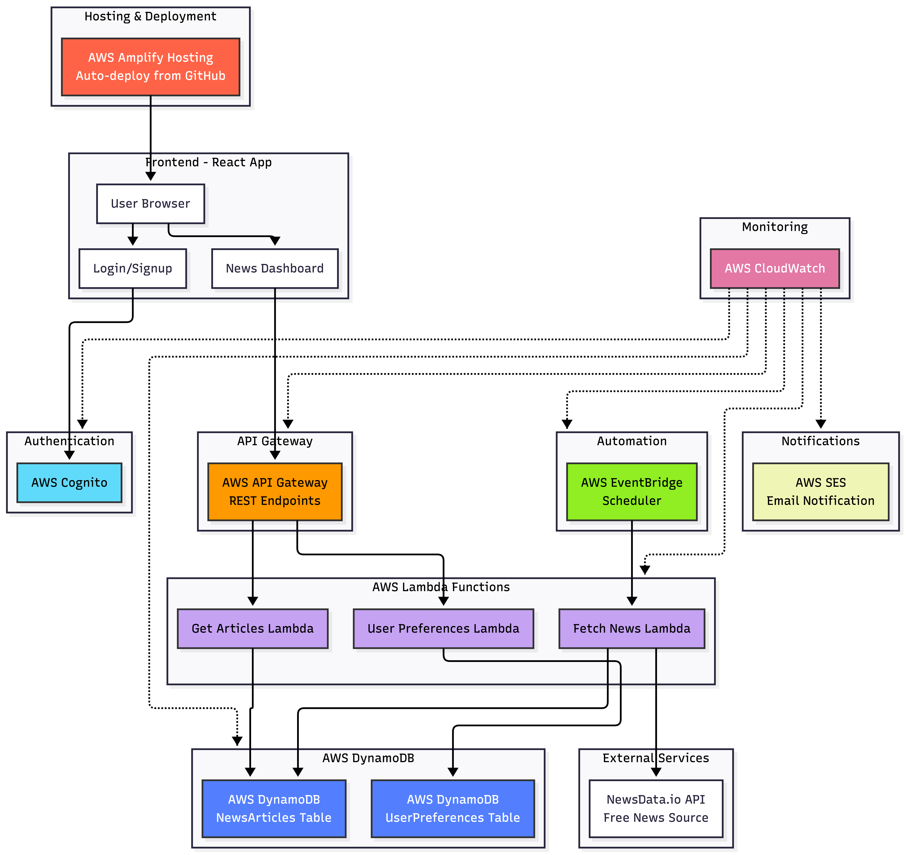

# MoodMedia: A News Sentiment Dashboard

A React-based web application that displays personalized news articles with sentiment analysis.

## Architecture Diagram



## AWS Services Used

- **AWS Cognito**: We selected Cognito over custom authentication solutions because it provides a fully managed, secure authentication service with built-in features like password policies and user management. This eliminates the need to handle sensitive authentication logic ourselves.

- **AWS Lambda**: We selected Lambda over EC2 instances because our news fetching and preference updates are triggered by specific events (scheduled times, user actions) rather than continuous processing. Also, there's no need to manage server infrastructure and maintain uptime.

- **AWS API Gateway**: We selected API gateway because it provides automatic request routing, built-in throttling, and seamless integration with Lambda functions.

- **AWS DynamoDB**: We selected DynamoDB over RDS or Aurora because our data model (user preferences and news articles) fits well with NoSQL's flexible schema. DynamoDB also provides native integration with Lambda through the AWS SDK.

- **AWS EventBridge**: We selected EventBridge over CloudWatch Events because it provides a more robust event-driven architecture with better error handling and retry mechanisms. EventBridge's rule-based scheduling integrates with Lambda for our daily news fetching tasks.

- **AWS SES (Simple Email Service)**: We selected SES over SNS because our requirement is to send newsletters to users. SES provides advanced email capabilities, including templates and deliverability features.

- **AWS CloudWatch**: We selected CloudWatch as our centralized monitoring solution because it automatically collects logs and metrics from all AWS services we use. This provides dashboards, alerts, and log analysis, which are essential for maintaining application health and performance.

- **AWS Amplify**: We selected Amplify over manual S3/CloudFront setup because it provides a complete CI/CD pipeline with automatic builds from GitHub. It is an appropriate solution to simplify the deployment and hosting of our React application.

## Setup Instructions

1. **Install dependencies**
   ```bash
   npm install
   ```
2. **Start development server**
   ```bash
   npm start
   ```
   Open [http://localhost:3000](http://localhost:3000) to view the app.

3. **Build for production**
   ```bash
   npm run build
   ```

## Deployment

### AWS Amplify Hosting

This project is configured for deployment on AWS Amplify with automatic builds.
- Every push to the connected branch triggers automatic build and deployment
- Build configuration is defined in `amplify.yml`

## Acknowledgments
* **Sentiment Analysis:** Powered by [vaderSentiment](https://github.com/cjhutto/vaderSentiment)
